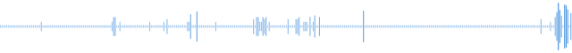
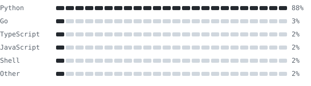

<h1 align="center">hey, i'm sid</h1>

i write code, mostly with headphones on

  
   
  <code>52 weeks of commits, as sound</code>

  
  
  
  
  

<table>
<tr>
<td width="50%" valign="top">

**side a · code**

`01` building 
<!--BUILDING:START-->
01 [yakitsu](https://github.com/sidkhuntia/yakitsu) 
02 [dsalgo](https://github.com/sidkhuntia/dsalgo) 
03 [rune](https://github.com/sidkhuntia/rune)
<!--BUILDING:END-->

`02` using · Java, TypeScript, React, Postgres

</td>
<td width="50%" valign="top">

**side b · music**

`04` on repeat · *Chlorine* by Twenty One Pilots

`05` fun fact · music can change everything

`06` say hi · links above

</td>
</tr>
</table>

### published apps

- [yakitsu](https://yakitsu.sidkhuntia.in)

### mixer

